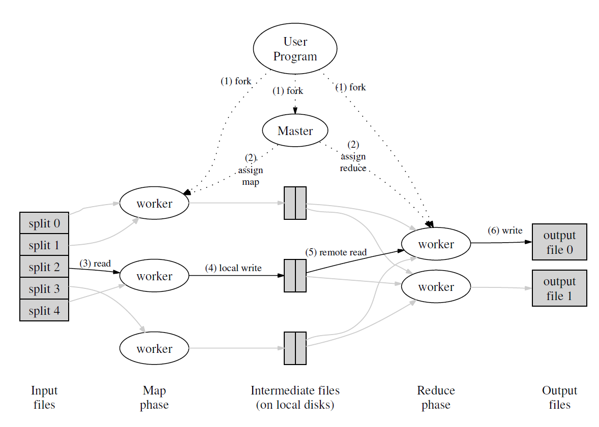

# 一、MapReduce论文解读

## 1 MapReduce是什么?

MapReduce是一种编程模型, 用于处理和大数据。其思想是使程序员能通过简单的Map函数和
Reduce函数的编写就能完成分布式计算的任务, 而不需要知道任何有关分布式的事情，MapReduce框架会处理剩下的事情。
## 2 MapReduce结构


上图所示是论文中对MapReduce架构描述, MapReduce中有如下术语:

- Worker: 分布式系统中不同计算机上运行的进程
- Master: 也是一个计算机上的进程, 负责协调整个处理过程，包括分配任务、监控进度和处理失败的工作节点
- Task: 计算任务, 包括Reduce和Map
- Map: 一个用用户程序提供的函数, 用于将输入的key:value转化为一组mid-key:mid-value
- Reduce: 一个用用户程序提供的函数, 用于将输入的mid-key:[]mid-value转化为输出output

通常, Master将Map和Reduce作为任务分配给Worker进行计算, 称为Map Task和Reduce Task, 以下是其一次MapReduce任务(称为Job)执行的过程:

1. **文件分片**
	通常是在任务开始之前由Master完成的。这是初始化阶段的一部分
2. Master分配Map TaskMaster将分片信息分配给Worker节点, 例如: 最开始将切割的文件名和文件内容作为key:value通过RPC提供给worker使其利用提供的map func进行计算, 这也是lab 1中的工作方式
3. **Map Task执行**
	Map Task的计算过程除了利用map func进行计算外, 还需要将输出的多个mid-key:mid-value分割成片存储于不同的本地文件, 不同的分片将提供给不同的Reduce Task, 通常使用Hash函数并对取Reduce Task的数量模得到分片序号。执行Map Task的Worker在执行结束后报告Master某个Map Task的执行情况
4. **Master等待所有的Map Task执行成功**
	Master根据Worker对Map Task的执行情况的报告进行决策, 保证所有的Map Task执行成功
5. Master分配Reduce TaskMaster会给Worker分配某个Reduce Task， Worker根据其任务序号读取之前所有Map Task对应分片的内容，这也是为什么要等待所有的Map Task执行成功后才执行Reduce Task，这样才能保证Reduce Task不遗漏mid-key, 整合这分片文件后遍历所有的`mid-key:[]mid-value`并应用reduce func, 并存储输出结果。同样， 执行Reduce Task的Worker在执行结束后报告Master某个Reduce Task的执行情况
6. **Master协调所有的Reduce Task执行成功**
	Master根据Worker对Reduce Task的执行情况的报告进行决策, 保证所有的Reduce Task执行成功、

最后, 不同的Job可以链式执行, 前一个Job的输出可以作为下一个Job的输入, 以此实现负责而庞大的计算任务
## 3 容错与恢复

- **心跳信号**：
	Worker只需要向Master发送心跳信号表示自身的存活, 如果Master在预定时间内没有收到来自某个Worker的心跳，它就会将该Worker标记为失效，并将其上运行的所有Map和Reduce任务重新调度到其他节点上。不过这种设计不太会再lab 1中出现, 因为这样会使Master记录太多有关Task和Worker的信息, 设计相对复杂
- **超时重试**
	如果一个Worker节点在执行Map或Reduce任务耗时过长，Master会检测到这种情况。Master将其认定为失败, 可以将失败的任务重新分配给其他健康的Worker节点执行。这种重试机制可以处理机器故障、软件错误或其他导致任务失败的问题。
-  `checkpointsMaster`会周期性地写入`checkpoints`到磁盘以预备可能的崩溃恢复
- **原子重命名**
	将Map和Reduce任务的输出写入到一个命名好的临时文件，并且只在任务成功完成时才对其进行重命名，来实现任务的幂等性。
- **文件系统备份**
	在MapReduce框架中，输入数据通常存储在一个分布式文件系统（如GFS）中，该文件系统会将数据块复制到多个节点上。这种数据副本机制确保了即使某些机器发生故障，数据仍然可用。

## 二、Lab1设计与实现

## 2.1 RPC设计

### 2.1.1. 消息类型

通信时首先需要确定这个消息是什么类型，通信的信息类型包括:
- Worker请求任务
- Coordinator分配Reduce或Map任务
- Worker报告Reduce或Map任务的执行情况
- Coordinator告知Worker任务状态

首先，定义一些所需要的常量，分为任务类型常量和任务状态常量：
```go
// 任务类型常量  
const (  
    MapTask    = "map"  
    ReduceTask = "reduce"  
    ExitTask   = "exit"  
    WaitTask   = "wait"  
)  
  
// 任务状态常量  
const (  
    Idle       = "idle"  
    InProgress = "in-progress"  
    Completed  = "completed"  
)
```

每一种消息类型会需要附带额外的信息, 例如Coordinator分配任务需要告知任务的ID, Map任务还需要告知NReduce,和输入文件名等等，站在Worker视角出发，需要定义请求任务和汇报任务状态两个消息类型

```go
// 请求任务
type GetTaskArgs struct {
	WorkerID int
}

type GetTaskReply struct {
	TaskID        int
	TaskType      string
	FileName      string
	MapTaskNum    int // 一共有多少个map任务
	ReduceTaskNum int // reduce任务的编号，负责分区编号
	NReduce       int // 一共有多少个reduce任务
}

// 汇报任务状态
type ReportTaskArgs struct {
	TaskType  string
	WorkerID  int
	TaskID    int
	Completed bool
}

type ReportTaskReply struct {
	OK bool
}
```

### 2.1.2 通信函数设计

Worker需要两个定义两个通信函数：
- 向Coordinator请求获取Task
- 向Coordinator报告之前的Task的是否执行完成

因此, `worker.go`中通信函数实现如下：
```go
func reportTaskDone(taskType string, taskID, workerID int) {  
    args := ReportTaskArgs{  
       TaskType:  taskType,  
       TaskID:    taskID,  
       WorkerID:  workerID,  
       Completed: true,  
    }  
    reply := ReportTaskReply{}  
    call("Coordinator.ReportTask", &args, &reply)  
}  
  
func getTask(workerID int) GetTaskReply {  
    args := GetTaskArgs{WorkerID: workerID}  
    reply := GetTaskReply{}  
    call("Coordinator.GetTask", &args, &reply)  
    return reply  
}
```

在`coordinator.go`有相应的处理函数:
```go
func (c *Coordinator) ReportTask(args *ReportTaskArgs, reply *ReportTaskReply) error{}

func (c *Coordinator) GetTask(args *GetTaskArgs, reply *GetTaskReply) error {}
```

## 2.2 Worker设计

### 2.2.1 Worker主函数设计

Woker所做的内容就是不断的请求任务、执行任务和回复任务执行情况
```go
func Worker(mapf func(string, string) []KeyValue,
	reducef func(string, []string) string) {

	workerID := os.Getpid()

	for {
		// 请求任务
		task := getTask(workerID)

		switch task.TaskType {
		case MapTask:
			doMap(task, mapf, workerID)
		case ReduceTask:
			doReduce(task, reducef, workerID)
		case WaitTask:
			time.Sleep(500 * time.Millisecond)
			continue
		case ExitTask:
			return
		}

	}
}
```

### 2.2.2 Map Task执行函数

doMap函数是执行具体的Map任务，这一部分的实现可以参考`main/mrsequential.go`中的顺序实现，参考官方的提示, 应该先为当前的中间文件使用临时名, 完成操作后再进行原子重命名
```go
func doMap(task GetTaskReply, mapf func(string, string) []KeyValue, workerID int) {
	filename := task.FileName
	file, err := os.Open(filename)
	if err != nil {
		log.Fatalf("cannot open %v", filename)
	}
	content, err := io.ReadAll(file)
	if err != nil {
		log.Fatalf("cannot read %v", filename)
	}
	file.Close()

	// 调用一下用户自定义map函数
	kva := mapf(filename, string(content))

	// 将中间结果分成nReduce个桶
	intermediate := make([][]KeyValue, task.NReduce)
	for _, kv := range kva {
		bucket := ihash(kv.Key) % task.NReduce
		intermediate[bucket] = append(intermediate[bucket], kv)
	}

	// 将每个桶放到对应的临时文件中
	for i := 0; i < task.NReduce; i++ {
		// 创建临时文件
		tempFile, err := os.CreateTemp("", "mr-tmp-*")
		if err != nil {
			log.Fatalf("cannot create temp file")
		}

		enc := json.NewEncoder(tempFile)
		for _, kv := range intermediate[i] {
			err := enc.Encode(&kv)
			if err != nil {
				log.Fatalf("cannot encode %v", kv)
			}
		}
		tempFile.Close()

		// 将临时文件重命名mr-map任务编号-reduce桶编号
		os.Rename(tempFile.Name(), fmt.Sprintf("mr-%d-%d", task.TaskID, i))
	}

	// 汇报任务完成
	reportTaskDone(task.TaskType, task.TaskID, workerID)
}
```

### 2.2.3 Reduce Task执行函数

doReduce函数是执行具体的Reduce任务，实现类似上面的doMap函数，也可以参考`main/mrsequential.go`中的顺序实现
```go
func doReduce(task GetTaskReply, reducef func(string, []string) string, workerID int) {
	reduceTaskNum := task.ReduceTaskNum
	mapTaskNum := task.MapTaskNum

	intermediate := []KeyValue{}

	// 读取该reduce任务负责的中间文件
	for i := 0; i < mapTaskNum; i++ {
		filename := fmt.Sprintf("mr-%d-%d", i, reduceTaskNum)
		file, err := os.Open(filename)
		if err != nil {
			log.Fatalf("cannot open %v", filename)
		}

		dec := json.NewDecoder(file)
		for {
			var kv KeyValue
			if err := dec.Decode(&kv); err != nil {
				break
			}
			intermediate = append(intermediate, kv)
		}
		file.Close()
	}

	// 对intermediate排序
	sort.Sort(ByKey(intermediate))

	// 创建reduce任务输出的临时文件
	tempFile, err := os.CreateTemp("", "mr-out-tmp-*")
	if err != nil {
		log.Fatalf("cannot create temp file")
	}

	// 对每个key调用reduce函数
	i := 0
	for i < len(intermediate) {
		j := i + 1
		for j < len(intermediate) && intermediate[j].Key == intermediate[i].Key {
			j++
		}
		values := []string{}
		for k := i; k < j; k++ {
			values = append(values, intermediate[k].Value)
		}
		output := reducef(intermediate[i].Key, values)
		fmt.Fprintf(tempFile, "%v %v\n", intermediate[i].Key, output)
		i = j
	}
	tempFile.Close()

	// 将临时文件重命名mr-out-reduce桶编号
	os.Rename(tempFile.Name(), fmt.Sprintf("mr-out-%d", reduceTaskNum))

	// 汇报任务完成
	reportTaskDone(task.TaskType, task.TaskID, workerID)
}
```

需要注意的是, 收集文件内容是使用了`map`, 而迭代`map`时, `key`的顺序是随机的, 因此需要进行对`key`排序的操作，这个对key排序操作的实现在`main/mrsequential.go`也有实现
```go
type ByKey []KeyValue  
  
// for sorting by key.  
func (a ByKey) Len() int           { return len(a) }  
func (a ByKey) Swap(i, j int)      { a[i], a[j] = a[j], a[i] }  
func (a ByKey) Less(i, j int) bool { return a[i].Key < a[j].Key }

// 截取上面doReduce函数中
// 对intermediate排序  
sort.Sort(ByKey(intermediate))
```

## 2.3 Coordinator设计

首先需要定义一个Task类型，其中记录了文件名、任务状态、任务开始时间、任务ID这些信息，下面是具体的Coordinator的结构定义
```go
type Task struct {
	FileName  string
	Status    string
	StartTime time.Time
	TaskID    int
}

type Coordinator struct {
	// Your definitions here.
	mu          sync.Mutex
	mapTasks    []Task
	reduceTasks []Task
	nReduce     int
	mapFinished bool
	allFinished bool
	files       []string
	nextTaskID  int
}
```

关于超时检测的作用：checkTimeout 函数通过检查任务的运行时间，识别那些分配给 Worker 但未在规定时间内完成的任务（即超时任务），并将其状态重置为 Idle，以便重新分配给其他 Worker。
checkTimeout 函数实现的核心逻辑是**基于时间戳的超时判断**
- **任务状态和时间戳**：对于每个任务包含 Status（状态）和 StartTime（开始时间）。当任务分配给 Worker 时（在 GetTask 方法中），任务状态被设置为 InProgress，并记录当前时间作为 StartTime。
- **超时判断**：checkTimeout 函数通过比较当前时间与任务的 StartTime 的差值，判断任务是否运行超过设置的超时时间。如果超过，则将任务状态从 InProgress 重置为 Idle。

```go
func (c *Coordinator) checkTimeout() {
	// 超时时间设置为10s
	timeout := 10 * time.Second

	now := time.Now()

	// 检查map任务是否超时
	if !c.mapFinished {
		allCompleted := true
		for i, task := range c.mapTasks {
			if task.Status == InProgress && now.Sub(task.StartTime) > timeout {
				// 任务已超时
				c.mapTasks[i].Status = Idle
			}
			if task.Status != Completed {
				allCompleted = false
			}
		}
		c.mapFinished = allCompleted
	}

	// 检查reduce任务是否超时
	allCompleted := true
	for i, task := range c.reduceTasks {
		if task.Status == InProgress && now.Sub(task.StartTime) > timeout {
			c.reduceTasks[i].Status = Idle
		}
		if task.Status != Completed {
			allCompleted = false
		}
	}
	c.allFinished = allCompleted
}
```

全局状态更新，定义在Coordinator结构中的mapFinished和allFinished状态用来跟踪作业进度
- **Map 任务完成状态**：函数检查所有 Map 任务的状态，判断是否全部完成。如果某个任务的状态不是 Completed，则 allCompleted 置为 false，从而更新 c.mapFinished。这确保只有当所有 Map 任务都完成时，Coordinator 才会开始分配 Reduce 任务。
- **整体作业完成状态**：类似地，函数检查所有 Reduce 任务的状态，更新 c.allFinished，表示整个 MapReduce 作业是否完成。当 allFinished 为 true 时，Coordinator 会通知 Worker 退出（通过 GetTask 返回 ExitTask）。

### 2.3.2 RPC 响应函数 - GetTask

这部分的处理逻辑是：
1. 调用 checkTimeout 函数，检查是否有 InProgress 状态的任务超时（超过 10 秒）。超时任务会被重置为 Idle，以便重新分配。
2. 检查是否所有任务已完成，如果都已完成，返回 ExitTask，通知 Worker 退出。
3. 如果 Map 阶段未完成，优先分配 Map 任务。遍历 mapTasks，寻找状态为 Idle 的任务，如果没有 Idle 状态的 Map 任务，返回 WaitTask，让 Worker 等待（可能其他 Worker 正在处理剩余的 Map 任务，或有任务超时后会被重置为 Idle）。
4. 如果 Map 阶段已完成，按上面同样的逻辑去处理Reduce Task的分配
5. 如果没有 Idle 状态的 Reduce 任务，返回 WaitTask，让 Worker 等待。
```go
// Worker调用此方法从Coordinator获取任务
func (c *Coordinator) GetTask(args *GetTaskArgs, reply *GetTaskReply) error {
	c.mu.Lock()
	defer c.mu.Unlock()

	// 检查超时任务
	c.checkTimeout()

	// 如果所有任务完成，通知worker退出
	if c.allFinished {
		reply.TaskType = ExitTask
		return nil
	}

	// 如果map任务还未执行完，分配map任务
	if !c.mapFinished {
		for i, task := range c.mapTasks {
			if task.Status == Idle {
				reply.TaskType = MapTask
				reply.TaskID = task.TaskID
				reply.FileName = task.FileName
				reply.NReduce = c.nReduce

				// 更新任务状态
				c.mapTasks[i].Status = InProgress
				c.mapTasks[i].StartTime = time.Now()
				return nil
			}
		}

		// 如果找不到一个空闲的map任务，但还没有执行完
		reply.TaskType = WaitTask
		return nil
	}

	// 如果所有map任务执行完，则分配reduce任务
	for i, task := range c.reduceTasks {
		if task.Status == Idle {
			reply.TaskType = ReduceTask
			reply.TaskID = task.TaskID
			reply.ReduceTaskNum = i
			reply.MapTaskNum = len(c.mapTasks)

			// 更新任务状态
			c.reduceTasks[i].Status = InProgress
			c.reduceTasks[i].StartTime = time.Now()
			return nil
		}
	}
	// 没有任何空闲的reduce任务
	reply.TaskType = WaitTask
	return nil
}
```

### 2.3.3 RPC 响应函数 - ReportTask

这个函数的实现只需要去改变对应的mapFinished和allFinished状态即可
```go
// Worker完成任务后调用此方法通知Coordinator
func (c *Coordinator) ReportTask(args *ReportTaskArgs, reply *ReportTaskReply) error {
	c.mu.Lock()
	defer c.mu.Unlock()

	if args.TaskType == MapTask {
		for i, task := range c.mapTasks {
			if task.TaskID == args.TaskID && task.Status == InProgress {
				c.mapTasks[i].Status = Completed

				// 检查所有map任务是否已经全部完成
				allCompleted := true
				for _, task := range c.mapTasks {
					if task.Status != Completed {
						allCompleted = false
						break
					}
				}
				c.mapFinished = allCompleted
				reply.OK = true
				return nil
			}
		}
	} else if args.TaskType == ReduceTask {
		for i, task := range c.reduceTasks {
			if task.TaskID == args.TaskID && task.Status == InProgress {
				c.reduceTasks[i].Status = Completed

				// 检查所有reduce任务是否已经全部完成
				allCompleted := true
				for _, task := range c.reduceTasks {
					if task.Status != Completed {
						allCompleted = false
						break
					}
				}
				c.mapFinished = allCompleted
				reply.OK = true
				return nil
			}
		}
	}
	reply.OK = false
	return nil
}

```